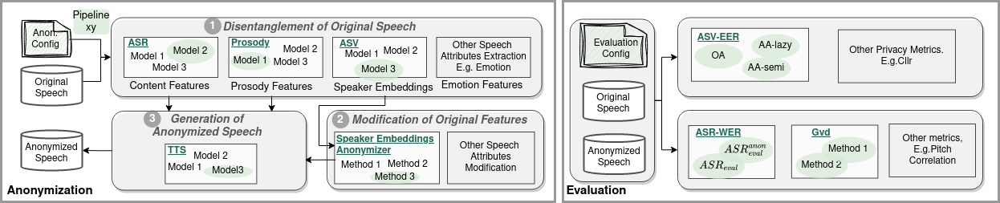

# [VoicePAT: Voice Privacy Anonymization Toolkit](http://arxiv.org/abs/2309.08049)

**Note: This repository and its documentation are still under construction but can already be used for both 
anonymization and evaluation. We welcome all contributions to introduce more generation methods or evaluation metrics to the VoicPAT framework. 
If you are interested in contributing, please leave comments on a GitHub issue.**

VoicePAT is a toolkit for speaker anonymization research, with special focus on speaker anonymization. 
It is based on the framework(s) by the [VoicePrivacy Challenges](https://github.com/Voice-Privacy-Challenge/Voice-Privacy-Challenge-2022) but contains the following improvements:

* It consists of **two separate procedures for anonymization and evaluation**. This means that the generation of 
  anonymized speech is independent of the evaluation of anonymization systems. Both processes do not need to be 
  executed in the same run or with the same settings. Of course, you need to perform the anonymization of evaluation 
  data with one system before you can evaluate it but this could have happened at an earlier time and with an 
  external codebase.
* Anonymization and evaluation procedures are **structured as pipelines** consisting of separate **modules**. Each 
  module may have a selection of different models or algorithm to fulfill its role. The settings for each procedure 
  / pipeline are defined exclusively in configuration files. See the *Usage* section below for more information.
* **Evaluation models** have been exchanged by models based on [SpeechBrain](https://github.com/speechbrain/speechbrain/) and [ESPnet](https://github.com/espnet/espnet/) which are **more powerful** than the 
  previous Kaldi-based models. Furthermore, we added new techniques to make evaluation significantly **more 
  efficient**.
* The framework is written in **Python**, making it easy to include and adapt other Python-based models, e.g., using 
  PyTorch. When using the framework, you do not need in-depth knowledge about anything outside the Python realm 
  (Disclaimer: While being written in Python, the ASR evaluation is currently included with an ESPnet-based model 
  which in turn is based on Kaldi. However, you do not need to modify that part of the code for using or 
  changing the ASR model and ESPnet is currently working on a Kaldi-free version.)


## Installation
Simply clone the repository and install the dependencies in [requirements.txt](requirements.txt). If you want to use 
the ESPnet-based ASR evaluation model, you additionally need to clone and install [ESPNet](https://github.com/espnet/espnet/) and insert the link to 
it in [evaluation/utility/asr/path.sh](evaluation/utility/asr/espnet_asr/path.sh), e.g., ``MAIN_ROOT=~/espnet``.

## Usage



For using the toolkit with the existing methods, you can use the configuration files in [configs](configs). You can 
also add more modules and models to the code and create your own config by using the existing ones as template.


### Anonymization
The framework currently contains only one pipeline and config for anonymization, [anon_ims_sttts_pc.yaml](configs/anon_ims_sttts_pc.yaml). If you are using this config, you need to modify at least the following entries:
```
data_dir: path to original data in Kaldi-format for anonymization
results_dir: path to location for all (intermediate) results of the anonymization
models_dir:  path to models location
```

Running an anonymization pipeline is done like this:
```
python run_anonymization.py --config anon_ims_sttts_pc.yaml --gpu_ids 0,1 --force_compute
```
This will perform all computations that support parallel computing on the gpus with ID 0 and 1, and on GPU 0 
otherwise. If no gpu_ids are specified, it will run only on GPU 0 or CPU, depending on whether cuda is available. 
`--force_compute` causes all previous computations to be run again. In most cases, you can delete that flag from the 
command to speed up the anonymization.

Pretrained models for this anonymization can be found at [https://github.
com/DigitalPhonetics/speaker-anonymization/releases/tag/v2.0](https://github.com/DigitalPhonetics/speaker-anonymization/releases/tag/v2.0) and earlier releases.

### Evaluation
All other config files in [configs](configs) can be used for evaluation with different settings. In these configs, 
you need to adapt at least
```
eval_data_dir: path to anonymized evaluation data in Kaldi-format
asr/libri_dir: path to original LibriSpeech dataset
```

Running an evaluation pipeline is done like this:
```
python run_evaluation.py --config eval_pre_ecapa_cos.yaml --gpu_ids 1,2,3
```
making the GPUs with IDs 1, 2 and 3 available to the process. If no GPU is specified, it will default to CUDA:0 or 
use all GPUs if 
cuda is available, or run on CPU otherwise.

Pretrained evaluation models can be found in release v1. 

## Acknowledgements
Several parts of this toolkit are based on or use code from external sources, i.e.,
* [VoicePrivacy Challenge 2022](https://github.com/Voice-Privacy-Challenge/Voice-Privacy-Challenge-2022), [ESPnet](https://github.com/espnet/espnet/), [SpeechBrain](https://github.com/speechbrain/speechbrain/) for evaluation
* the [GAN-based anonymization system by IMS (University of Stuttgart)](https://github.com/DigitalPhonetics/speaker-anonymization) 
  for 
  anonymization

See the READMEs for [anonymization](anonymization/README.md) and [evaluation](evaluation/README.md) for more 
information.

